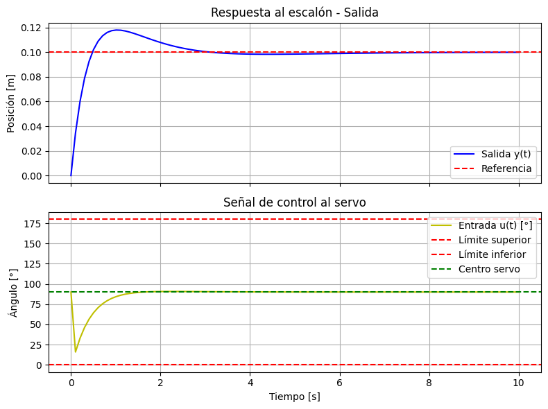

# 🎯 Proyecto Ball and Beam con PID y ESP32

Este proyecto implementa un sistema **Ball and Beam** controlado mediante un **controlador PID**, calculado y ajustado desde una interfaz gráfica hecha con **Streamlit**, y ejecutado en una **ESP32** que maneja sensores láser y un servomotor.

---

## 📌 Descripción de la planta

La planta utilizada corresponde al modelo clásico de Ball and Beam descrito en la Universidad de Michigan:  
[https://ctms.engin.umich.edu/CTMS/index.php?example=BallBeam&section=SystemModeling](https://ctms.engin.umich.edu/CTMS/index.php?example=BallBeam&section=SystemModeling)

Se modela como:

\[
P(s) = \frac{k}{s^2}
\]

donde:
- **m** = 0.021 kg (masa de la bola),
- **g** = 9.81 m/s² (gravedad),
- **d** = 0.05 m (distancia eje-haz),
- **L** = 0.4 m (longitud del haz),
- **J** = 9.99e-6 kg·m² (momento de inercia de la bola),
- **Radio** = 0.03 m (radio de la bola).

---

## ⚡ Hardware

### 🔩 Servomotor
- **Modelo:** MG996R 11Kg (4.8 V) Piñonería metálica.
- **Pin de control:** GPIO 18 de la ESP32.
- **GND del servo:** debe ir al mismo GND de la ESP32.

### 📡 Sensores láser
Se utilizan dos sensores **VL53L0X** conectados por I2C:
- **SDA:** GPIO 21 (estándar I2C)
- **SCL:** GPIO 22 (estándar I2C)
- **XSHUT1:** GPIO 23
- **XSHUT2:** GPIO 19  
Estos pines XSHUT permiten inicializar cada sensor con una dirección I2C distinta.

---

## 🖥️ Software

El proyecto se compone de los siguientes directorios y archivos:

### 🤖 Código para la ESP32

- [`controlpid/controlpid.ino`](controlpid/controlpid.ino):  
  Código cargado en la ESP32.  
  - Inicializa los dos sensores VL53L0X por I2C (SDA=21, SCL=22, XSHUT en pines 19 y 23).
  - Controla el servomotor MG996R por el pin 18.
  - Ejecuta el PID con parámetros enviados por WiFi desde la aplicación.

- [`controlpid/prueba_wifi/prueba_wifi.ino`](controlpid/prueba_wifi/prueba_wifi.ino):  
  Código de prueba para conectarse al WiFi y obtener la IP de la ESP32.  
  ⚠️ Usa este código para averiguar la IP que debes configurar en la app Streamlit 
  (main.py).

---

### 📒 Simulación teórica

- [`cont_teorico/teorico.ipynb`](cont_teorico/teorico.ipynb):  
  Aquí se desarrolla la simulación teórica de la planta y se calculan los valores iniciales del PID:

```python
alpha = k
n = 3

wn = 0.799
zeta = 0.95

kp = (wn**2 * (2*zeta*n + 1)) / alpha
ki = (n*wn**3) / alpha
kd = (wn*(2*zeta+n))/ alpha
```


✅ Valores iniciales calculados:

    Kp = -5.33

    Ki = -1.91

    Kd = -4.88

    Ts = 0.2

🖼️ Resultados de la simulación:





--- 

🌐 Aplicación Streamlit
streamlit_app/main.py

    Interfaz gráfica principal.

    Permite ingresar parámetros de diseño y ver la simulación.

    Envía los valores de Kp, Ki, Kd y la referencia a la ESP32 usando la IP obtenida con prueba_wifi.ino.

streamlit_app/controlador.py

    Función calcular_pid_y_simular:

        Define la planta.

        Calcula Kp, Ki y Kd.

        Simula respuesta al escalón y genera u_deg (señal para el servo).

streamlit_app/enviar_esp.py

    Función enviar_pid_wifi:

        Envía parámetros al ESP32 mediante una petición HTTP GET.

        Uso ejemplo en main.py:

        ok, mensaje = enviar_pid_wifi(kp, ki, kd, dist, ip_esp32="192.168.1.50")

▶️ Cómo ejecutar la app Streamlit

    Ejecuta Streamlit:

```bash streamlit run streamlit_app/main.py```

    En la interfaz, ajusta los parámetros y presiona el botón Enviar PID al ESP32.
    Antes de enviar, asegúrate de haber cargado controlpid.ino en la ESP32 y de haber configurado la IP correcta que obtuviste con prueba_wifi.ino.

---

▶️ Cómo ejecutar el proyecto en fisico

    Sube el codigo *controlpid.ino* a la esp32